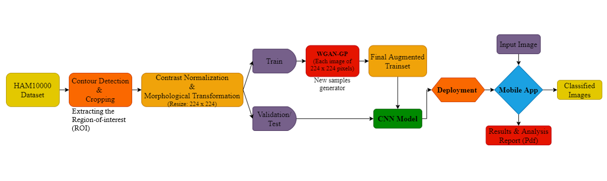
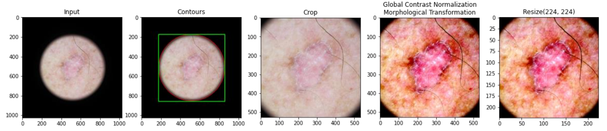
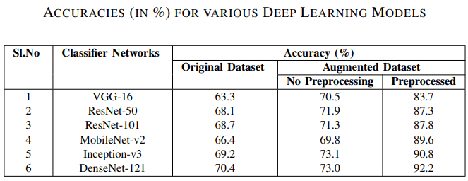
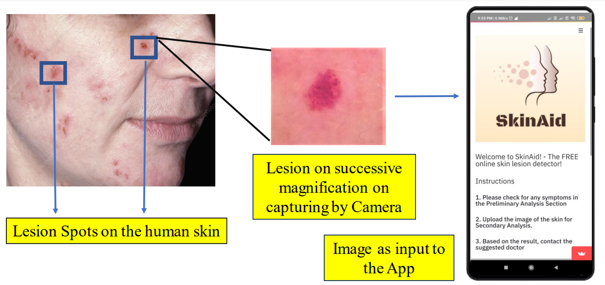

# 🧠 SkinAid: A GAN-based Automatic Skin Lesion Monitoring Framework for IoMT

This repository contains the official implementation of our paper:

> **SkinAid: A GAN-based Automatic Skin Lesion Monitoring Method for IoMT Frameworks**  
> *2021 19th OITS International Conference on Information Technology (OCIT)*  
> 📄 [View Paper on IEEE Xplore](https://ieeexplore.ieee.org/document/9719383)

---

## 👨‍🔬 Authors
Prathistith Raj Medi, Praneeth Nemani, Pitta Vivek Reddy,  
Dr. Venkanna Udutalapally, Dr. Debanjan Das, and Dr. Saraju P. Mohanty

---

## 🩺 Abstract
Skin lesions are among the most common precursors to serious dermatological conditions such as melanoma. Early detection can significantly reduce risk and improve patient outcomes.  
**SkinAid** presents an automated **IoMT-based (Internet of Medical Things)** system for detecting and classifying skin lesions through deep learning and **Wasserstein-GAN-based data augmentation**.  

The model enhances a limited and highly unbalanced dermatology dataset using synthetic data generation, followed by CNN-based classification for **seven major lesion types**.  
It achieves an overall accuracy of **92.2%**, with real-time deployment on Android devices for remote screening and early diagnosis.

---

## 📘 Table of Contents
- [Overview](#-overview)
- [Dataset](#-dataset)
- [Preprocessing & ROI Extraction](#-preprocessing--roi-extraction)
- [Synthetic Image Generation (W-GAN-GP)](#-synthetic-image-generation-w-gan-gp)
- [Model Training & Results](#-model-training--results)
- [Mobile App Prototype](#-mobile-app-prototype)
- [Contributions](#-contributions)
- [Citation](#-citation)

---

## 🌐 Overview


SkinAid comprises three major phases:
1. **Preprocessing & ROI Extraction:** isolates the lesion region and removes noise.
2. **Data Augmentation via WGAN-GP:** generates synthetic dermatoscopic samples to balance the dataset.
3. **CNN-based Classification & IoMT Deployment:** classifies lesion types and deploys on Android for real-time use.

---

## 🧾 Dataset
We use the **HAM10000** (“Human Against Machine with 10,000 training images”) dataset — a benchmark dermatology dataset comprising **10,015 dermatoscopic images** of 7 lesion types:

| Lesion Type | Description |
|--------------|-------------|
| AKIEC | Actinic Keratosis |
| BCC | Basal Cell Carcinoma |
| BKL | Benign Keratosis |
| DF | Dermatofibroma |
| MEL | Melanoma |
| NV | Melanocytic Nevi |
| VASC | Vascular Lesions |

📦 Dataset source: [Kaggle - Skin Cancer MNIST: HAM10000](https://www.kaggle.com/datasets/kmader/skin-cancer-mnist-ham10000)

---

## ⚙️ Preprocessing & ROI Extraction
To ensure high-quality training data, we extracted the **region-of-interest (ROI)** of skin lesions using segmentation masks and morphological transformations.

### (a) ROI Extraction Example:


---

## 🧬 Synthetic Image Generation (W-GAN-GP)
We used **Wasserstein-GAN with Gradient Penalty (WGAN-GP)** to synthetically augment minority lesion classes.

### (a) Preprocessing Steps


### (b) Synthetic Image Samples


🧪 *Sample synthetic data generated by W-GAN:*  
(a) Actinic Keratosis, (b) Melanoma, (c) Melanocytic Nevi, (d) Vascular Lesions.

---

## 🧠 Model Training & Results
To classify the skin lesions, we fine-tuned multiple CNN architectures using **transfer learning**:
- ResNet-50  
- EfficientNet-B0  
- DenseNet-121 *(best performance)*  
- MobileNet-V2  

Each model was trained on the augmented dataset (original + synthetic samples).  
DenseNet-121 achieved **92.2% test accuracy** with improved generalization and balanced class distribution.



---

## 📱 Mobile App Prototype (IoMT Integration)
We designed a lightweight **Android application** for edge-based inference, enabling **offline lesion detection and classification** in resource-limited environments.



**Features:**
- Real-time lesion capture using a smartphone camera  
- On-device CNN inference (no internet required)  
- Displays lesion type, confidence score, and risk level  
- Ideal for rural healthcare centers and tele-dermatology  

---

## 🧩 Key Contributions
✔️ Implemented advanced **preprocessing** pipeline for feature enhancement  x
✔️ Used **WGAN-GP** for data augmentation to overcome dataset imbalance  
✔️ Applied **transfer learning** with modern CNN architectures  
✔️ Achieved **92.2% accuracy** using DenseNet-121  
✔️ Deployed prototype on Android for IoMT-based lesion classification  
✔️ Proposed a **low-cost, offline diagnostic solution** for remote healthcare

---

## 🧠 Architecture Diagram


---

## 🧾 Citation
If you find this repository useful or reference this work in your research, please cite:

```bibtex
@inproceedings{medi2021skinaid,
  title={SkinAid: A GAN-based Automatic Skin Lesion Monitoring Method for IoMT Frameworks},
  author={Medi, Prathistith Raj and Nemani, Praneeth and Reddy, Pitta Vivek and Udutalapally, Venkanna and Das, Debanjan and Mohanty, Saraju P.},
  booktitle={2021 19th OITS International Conference on Information Technology (OCIT)},
  year={2021},
  organization={IEEE}
}
