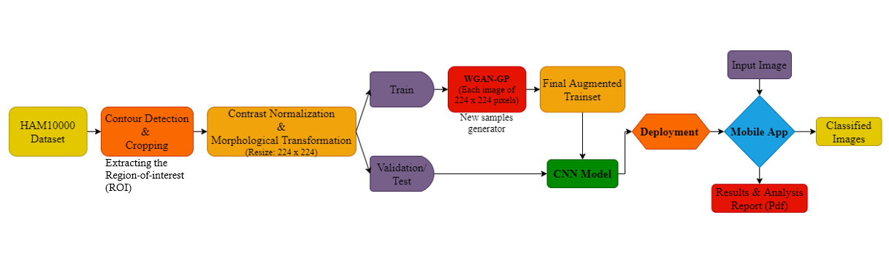
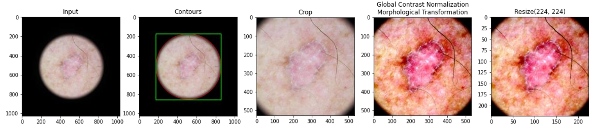
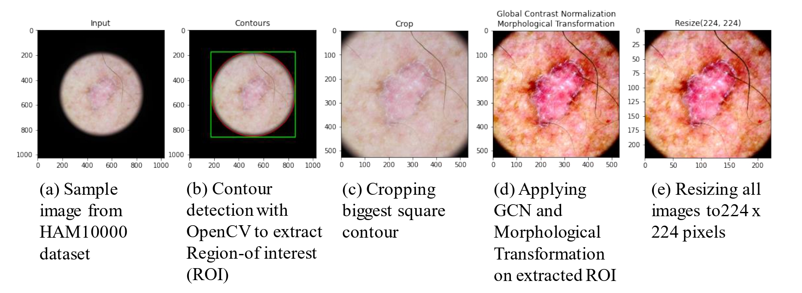
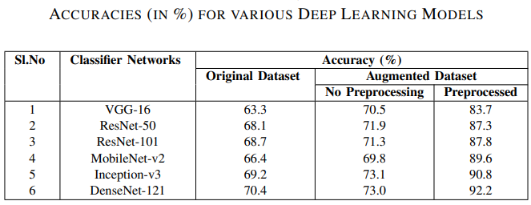
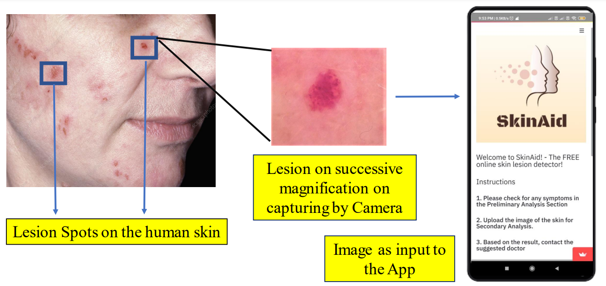

# 🧠 SkinAid: A GAN-based Automatic Skin Lesion Monitoring Framework for IoMT

[](https://ieeexplore.ieee.org/document/9719383)
[](https://doi.org/10.1109/OCIT53463.2021.00048)


This repository contains the official implementation of our paper:

> **SkinAid: A GAN-based Automatic Skin Lesion Monitoring Method for IoMT Frameworks**  
> *2021 19th OITS International Conference on Information Technology (OCIT)*  
> 📄 [View Paper on IEEE Xplore](https://ieeexplore.ieee.org/document/9719383) · DOI [10.1109/OCIT53463.2021.00048](https://doi.org/10.1109/OCIT53463.2021.00048)

---

## 👨‍🔬 Authors
Prathistith Raj Medi, Praneeth Nemani, Pitta Vivek Reddy,  
Dr. Venkanna Udutalapally, Dr. Debanjan Das, and Dr. Saraju P. Mohanty

---

## 🩺 Abstract
Skin lesions are among the most common precursors to serious dermatological conditions such as melanoma. Early detection can significantly reduce risk and improve patient outcomes.  
**SkinAid** presents an automated **IoMT-based (Internet of Medical Things)** system for detecting and classifying skin lesions through deep learning and **Wasserstein-GAN-based data augmentation**.  

The model enhances a limited and highly unbalanced dermatology dataset using synthetic data generation, followed by CNN-based classification for **seven major lesion types**.  
It achieves an overall accuracy of **92.2%**, with real-time deployment on Android devices for remote screening and early diagnosis.

---

## 📘 Table of Contents
- [Overview](#-overview)
- [Dataset](#-dataset)
- [Preprocessing & ROI Extraction](#-preprocessing--roi-extraction)
- [Synthetic Image Generation (W-GAN-GP)](#-synthetic-image-generation-w-gan-gp)
- [Model Training & Results](#-model-training--results)
- [Mobile App Prototype](#-mobile-app-prototype)
- [Code in this repository](#-code-in-this-repository)
- [Follow-up work](#-follow-up-work)
- [Contributions](#-key-contributions)
- [Citation](#-citation)

---

## 🌐 Overview


SkinAid comprises three major phases:
1. **Preprocessing & ROI Extraction:** isolates the lesion region and removes noise.
2. **Data Augmentation via WGAN-GP:** generates synthetic dermatoscopic samples to balance the dataset.
3. **CNN-based Classification & IoMT Deployment:** classifies lesion types and deploys on Android for real-time use.

---

## 🧾 Dataset
We use the **HAM10000** (“Human Against Machine with 10,000 training images”) dataset — a benchmark dermatology dataset comprising **10,015 dermatoscopic images** of 7 lesion types:

| Lesion Type | Description |
|--------------|-------------|
| AKIEC | Actinic Keratosis |
| BCC | Basal Cell Carcinoma |
| BKL | Benign Keratosis |
| DF | Dermatofibroma |
| MEL | Melanoma |
| NV | Melanocytic Nevi |
| VASC | Vascular Lesions |

📦 Dataset sources: [Harvard Dataverse (original release)](https://doi.org/10.7910/DVN/DBW86T) · [ISIC 2018 Challenge, Task 3](https://challenge.isic-archive.com/data/#2018) · [Kaggle mirror](https://www.kaggle.com/datasets/kmader/skin-cancer-mnist-ham10000)

---

## ⚙️ Preprocessing & ROI Extraction
Every image goes through the same pipeline (paper §III-B):

1. **Contour detection and cropping:** grayscale, threshold, `cv2.findContours`, then crop to the lesion's bounding region (ROI), dropping the surrounding skin and background.
2. **Global contrast normalisation (GCN):** subtract the image mean and divide by its standard deviation.
3. **Morphological transformation:** dilation and erosion together, to reconnect fragmented lesion pixels and suppress noise.
4. **Resize** to 224 × 224 × 3.

### (a) ROI Extraction Example:


---

## 🧬 Synthetic Image Generation (W-GAN-GP)
We used **Wasserstein-GAN with Gradient Penalty (WGAN-GP)** to synthetically augment minority lesion classes.

### (a) Preprocessing Steps


### (b) Synthetic Image Samples


🧪 *Sample synthetic data generated by W-GAN:*  
(a) Actinic Keratosis, (b) Melanoma, (c) Melanocytic Nevi, (d) Vascular Lesions.

---

## 🧠 Model Training & Results
A per-class WGAN-GP generated **27,055** synthetic images, bringing every minority class close to the
size of the largest (melanocytic nevi, 5,822 training images); the augmented training set has
35,967 images. Six ImageNet-pretrained CNNs were then fine-tuned with transfer learning and
compared on the original data, the augmented data, and the augmented *and* preprocessed data
(paper Table IV, accuracy in %):

| Classifier | Original dataset | Augmented, no preprocessing | Augmented + preprocessed |
|---|---:|---:|---:|
| VGG-16 | 63.3 | 70.5 | 83.7 |
| ResNet-50 | 68.1 | 71.9 | 87.3 |
| ResNet-101 | 68.7 | 71.3 | 87.8 |
| MobileNet-v2 | 66.4 | 69.8 | 89.6 |
| Inception-v3 | 69.2 | 73.1 | 90.8 |
| **DenseNet-121** | 70.4 | 73.0 | **92.2** |

Per-class results for DenseNet-121 (paper Table V):

| Class | Precision | Recall | F1 |
|---|---:|---:|---:|
| Actinic keratosis | 0.75 | 0.73 | 0.739 |
| Basal cell carcinoma | 0.75 | 0.80 | 0.774 |
| Melanoma | 0.85 | 0.73 | 0.785 |
| Dermatofibroma | 0.85 | 0.75 | 0.796 |
| Melanocytic nevi | 0.94 | 0.96 | 0.949 |
| Vascular lesions | 0.83 | 0.76 | 0.792 |
| Benign keratosis | 0.78 | 0.71 | 0.743 |

The trained PyTorch model was exported through **ONNX** to a TensorFlow `.pb` graph for the
Android app.



---

## 📱 Mobile App Prototype (IoMT Integration)
We designed a lightweight **Android application** for edge-based inference, enabling **offline lesion detection and classification** in resource-limited environments.



**Features:**
- Lesion capture with the smartphone camera
- On-device classification into the seven classes, with no internet connection required (tested on 4 GB RAM; minimum 2.5 GB RAM, 150 MB storage, 8 MP camera)
- A symptom check and a preliminary analysis of the lesion, for health workers and dermatologists
- Aimed at rural health centres and tele-dermatology

---

## 🧩 Key Contributions
✔️ Implemented advanced **preprocessing** pipeline for feature enhancement  
✔️ Used **WGAN-GP** for data augmentation to overcome dataset imbalance  
✔️ Compared **six** ImageNet-pretrained CNNs with transfer learning  
✔️ Achieved **92.2% accuracy** using DenseNet-121  
✔️ Deployed prototype on Android for IoMT-based lesion classification  
✔️ Proposed a **low-cost, offline diagnostic solution** for remote healthcare

---

## 💻 Code in this repository

This is the WGAN-GP code used for the paper's synthetic-data stage.
The training procedure is as it was in 2021; the scripts now take command-line arguments and run on
current PyTorch.

Two things worth knowing when comparing the code with the paper:

- The paper describes 224 × 224 × 3 images throughout; the generator here is built for 64 × 64 or
  128 × 128 output and the training script uses 128 × 128.
- The paper's equation 4 adds part of the generated images to the *test* set as well as the training
  set, so the reported accuracies are measured partly on synthetic images. The follow-up below
  re-evaluates the question on real, lesion-level held-out data only.

| File | Purpose |
|---|---|
| [`wgan_gp.py`](wgan_gp.py) | WGAN-GP training loop (5 critic steps per generator step, λ = 10, Adam β = (0, 0.9), 128×128 RGB); trains one generator per lesion class from a folder of that class's images |
| [`model/generator.py`](model/generator.py), [`model/discriminator.py`](model/discriminator.py) | DCGAN-style generator, and a convolutional critic that scores a 5×5 grid of patches per 128×128 image |
| [`utils.py`](utils.py) | Gradient penalty and loss / Wasserstein-distance plots |
| [`dataset.py`](dataset.py) | Image-folder dataset (skips non-image files, always yields RGB) |
| [`generate.py`](generate.py) | Sample synthetic images from a trained generator checkpoint |
| [`synthetic_samples/`](synthetic_samples) | Example generator output |

**Running it.** One generator is trained per lesion class, from a folder of that class's images:

```bash
pip install -r requirements.txt
python wgan_gp.py --data data/DF --epochs 10000          # checkpoints/, training/ samples, plots/ losses
python generate.py --checkpoint checkpoints/generator_best.pt --out synthetic/DF --n 500
```

`python wgan_gp.py --help` lists every option. The training procedure itself (critic schedule,
gradient penalty, optimiser settings) is unchanged from the paper. CI trains for two epochs on a
handful of random images and generates from the result, so the scripts are known to run on current
PyTorch.

---

## 🔬 Follow-up work

[**LesionBench**](https://github.com/VivekReddy2001/lesionbench) revisits
this paper's question, whether synthetic images help imbalanced
dermoscopy classification, as a reproducible benchmark. It uses the
official ISIC 2018 release of HAM10000 and **lesion-level train/test
splits**. HAM10000 contains several photographs of the same lesion, and
with an image-level split about a third of test images have a sibling
photo in the training set. The benchmark compares GAN augmentation
against class weighting, focal loss, oversampling and classic
augmentation, with balanced accuracy, macro-F1 and calibration, averaged
over seeds.

---

## 🧾 Citation
If you find this repository useful or reference this work in your research, please cite:

```bibtex
@inproceedings{medi2021skinaid,
  title={SkinAid: A GAN-based Automatic Skin Lesion Monitoring Method for IoMT Frameworks},
  author={Medi, Prathistith Raj and Nemani, Praneeth and Pitta, Vivek Reddy and Udutalapally, Venkanna and Das, Debanjan and Mohanty, Saraju P.},
  booktitle={2021 19th OITS International Conference on Information Technology (OCIT)},
  year={2021},
  organization={IEEE},
  doi={10.1109/OCIT53463.2021.00048}
}

---

## 📄 Licence

All rights reserved. The code is shared for reading and reproducing the paper's results; for
any other use, please get in touch.
